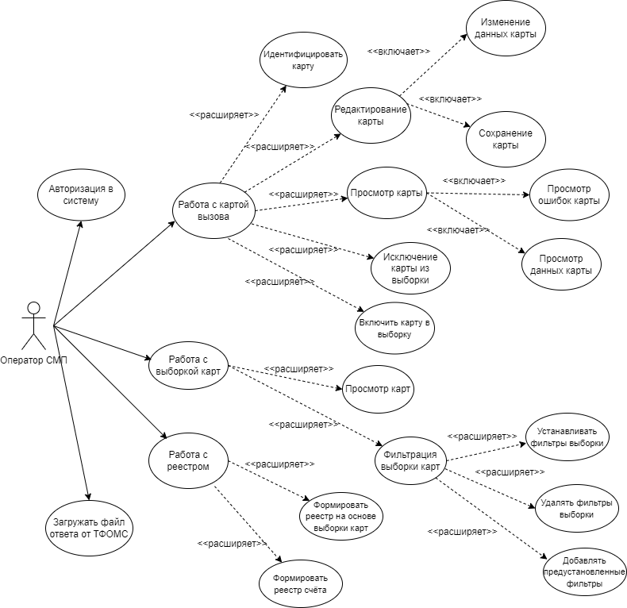

# Лабораторная работа 1 

## 1. Перечень заинтересованных лиц
* Операторы СМП - основные пользователи системы, будут осуществлять просмотр, редактирование карт закрытых вызовов, формирование реестра.

## 2. Функциональные требования
1. **Доступ к системе:**
    * Аутентификация и авторизация пользователей в системе
2. **Работа с закрытыми картами вызовов:**
    * Просмотр карты
    * Просмотр ошибок карты
    * Редактирование карты
    * Идентификация карты пациента в ТФОМС
    * Включение/исключение карты из выборки
    * Сохранение изменений в карте
3. **Выборка карт:**
    * Просмотр карт 
    * Возможность фильтровать выборку карт по определенным полям
    * Возможность сбрасывать назначенные фильтры
    * Добавление предустановленных фильтров
4. **Формирование реестра:**
    * Возможность формировать реестр на основе выборки карт
    * Возможность формировать реестр счёта
5. **Работа с файлом ответа от ТФОМС:**
    * Возможность загружать файл ответа от ТФОМС в систему

## 3. Диаграмма вариантов использования для функциональных требований

## 4. Перечень сделанных предположений

* В связи с задачами импортозамещения необходимо разработать систему, которая будет доступна с разных операционных систем
* Необходимо разработать и развернуть систему, которая будет доступна только в закрытой сети, на разных станция скорой помощи (в разных городах)

## 5. Нефункциональные требования

* Безопасность - данные закрытых карт вызовов должны храниться в защищенной базе данных, доступ к системе должны иметь ограниченное число пользователей
* Масштабируемость - со временем карты вызовов станут занимать много место, необходимо масштабировать базу данных карт вызовов