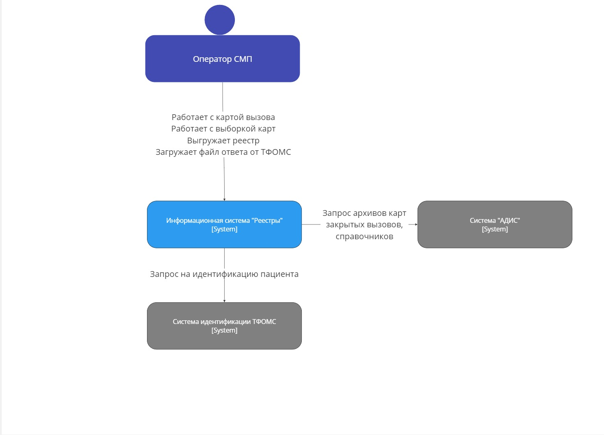
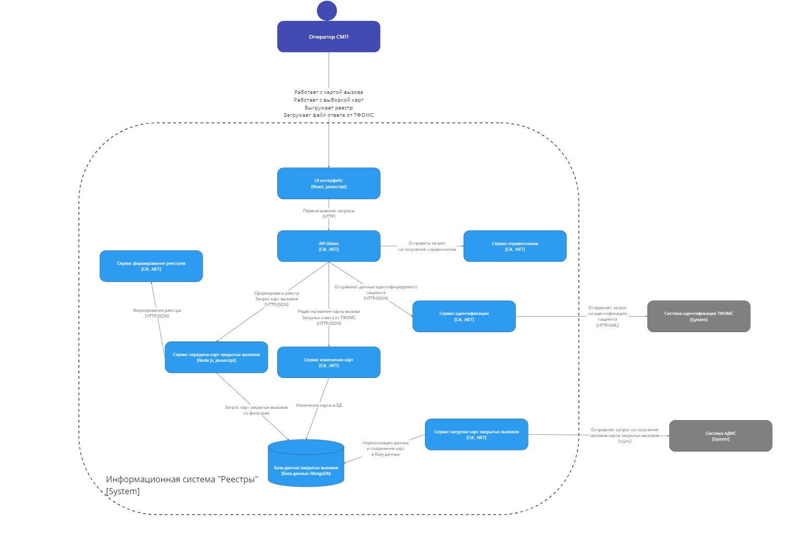
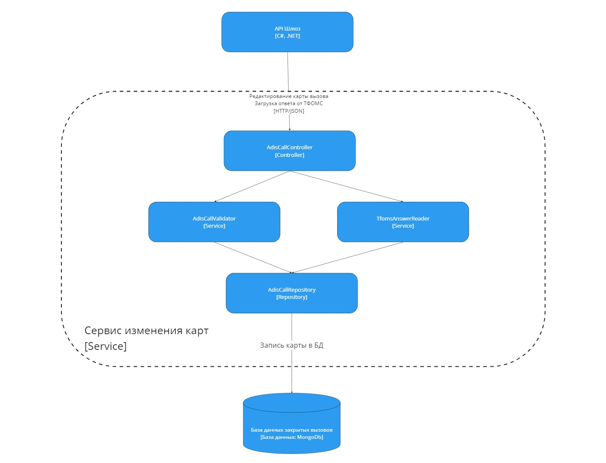

# Лабораторная работа 2

##1. Диаграмма системного контекста

##2. Диаграмма контейнеров

###Архитектурный стиль: микросервисная архитектура
 * Разбиение ответственности между сервисами
 * Независимое развертывание 
 * Масштабирование 
 * Отказоустойчивость

##3. Диаграмма компонентов

