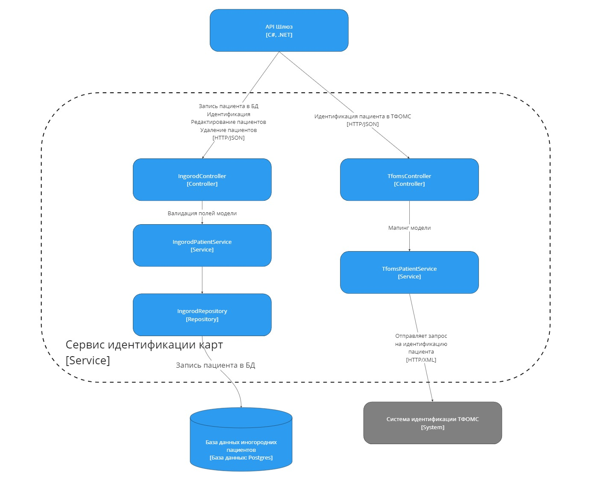
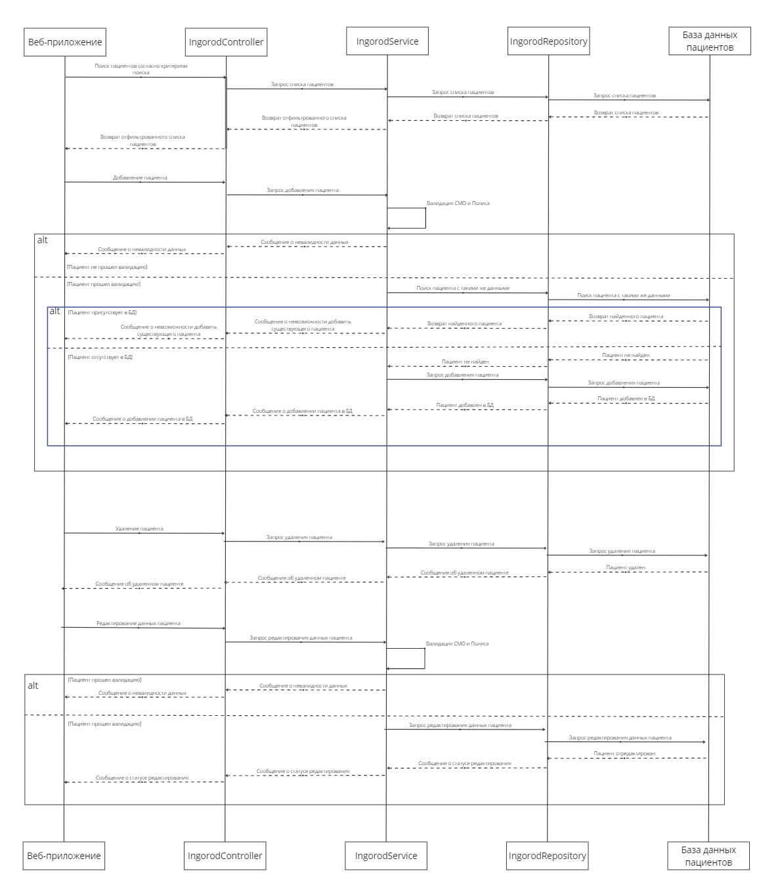
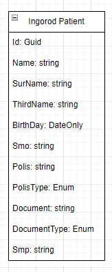

# Лабораторная работа 3

## 1. Диаграмма компонентов 
Сервис идентификации и работы с иногородними пациентами

## 2. Диаграмма вариантов использования работы с иногородними пациентами

Пояснения диаграммы использования:

1. Поиск пациента:
    * Пользователь вводит критерии поиска пациентов (ФИО, дата рождения, полис и т.д.)
    * Controller делает запрос Repository согласно заданным фильтрам, Repository обращается к БД для поиска пациентов
    * Ситема отображает пользователю отфильтрованный список пациентов
2. Добавление пациента:
    * Пользователь заполняет необходимые данные для добавления нового пациента
    * Service проводит валидация СМО (не должен начинаться с кода региона, так как пациент - иногородний) и номер полиса (16 символов)
    * В случае если данные не прошли валидацию, возвращается соотвествующее сообщение
    * Service отправляет запрос Repository на получение пациента по данным (ФИО, дата рождения)
    * Если такой пациент уже присутствует в БД, система уведомляет пользователя, что такой пациент уже присутствует в БД и не создает новую запись
    * В случае валидности данных и если пациента нет в БД, система добавляет нового пациента в БД, возвращается сообщение о добавлении пациента
3. Удаление пациента:
    * Пользователь отправляет запрос на удаление пациента 
    * Система удаляет выбранного пациента из БД
    * Система возвращает сообщение о удалении пациента
4. Обновление пациента:
    * Пользователь отправляет запрос на редактирование пациента
    * Система получает пациента из БД
    * Service проводит валидацию СМО и номера полиса
    * Система уведомляет пользователя о статусе редактирования пациента

## 3. Модель базы данных

* База данных содержит всего 1 модель иногороднего пациента.

## 4. Применение основных принципов разработки

