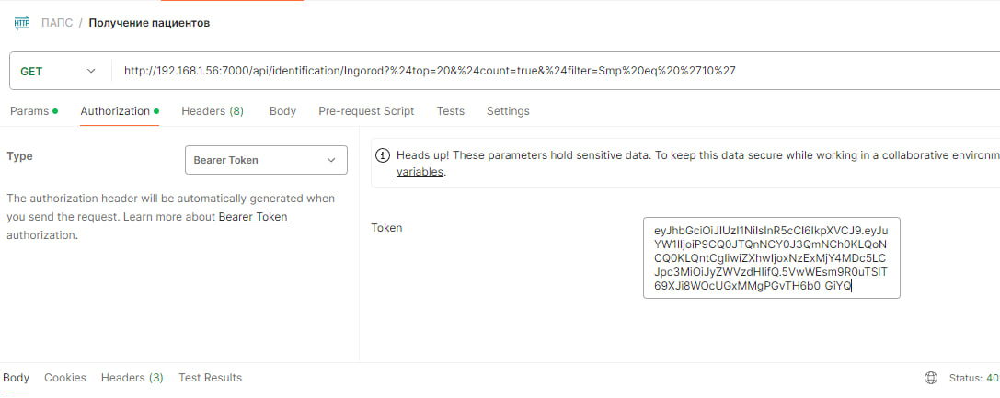
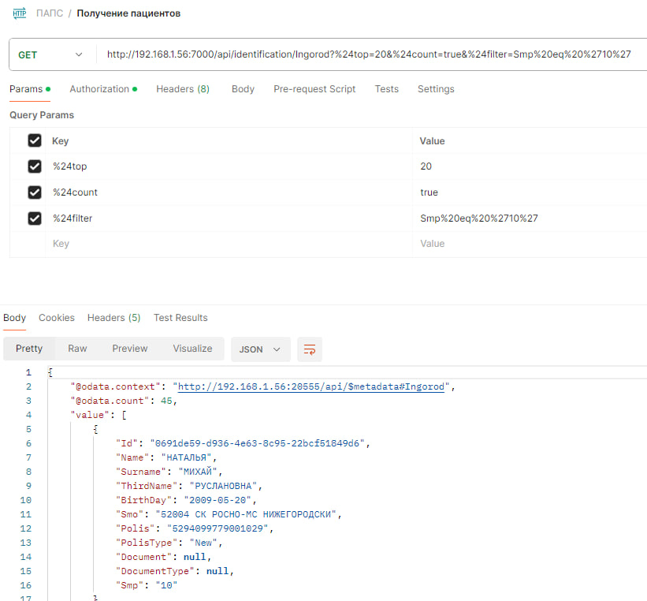
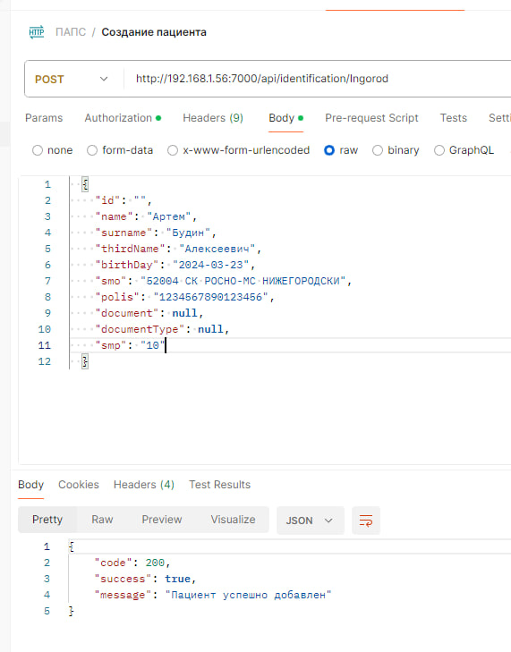
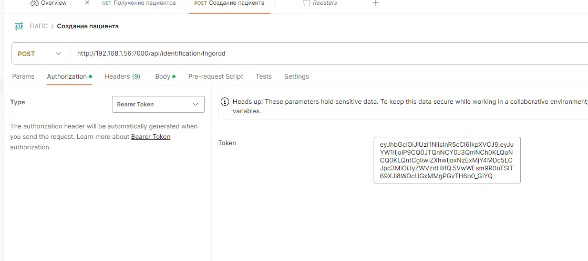
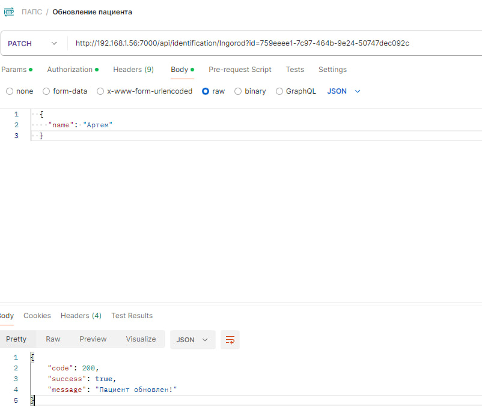
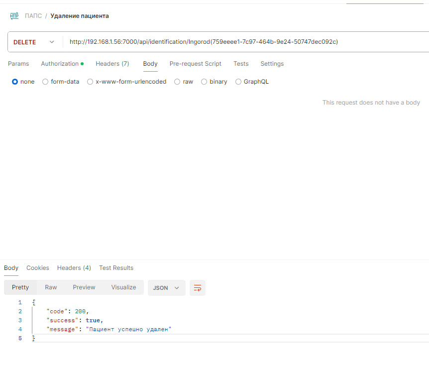

# Лабораторная работа 4

## Документация по api

Работа с иногородними пациентами

#### Примечание:
* Так как все api работают с веб-интерфейсом, все ответы возвращают статус OK (200) для облегчения обработки ответов, внутри себя содержат DTO c со следующей структурой:

        {
            code: HttpStatusCode (int),
            message: string,
            success: bool
        }
    Все коды статусов ответов, описанных ниже будут взяты из DTO.

#### GET /api/Ingorod

Описание: получить иногородних пациентов. Возвращает список пациентов согласно введенным параметрам поиска.

Заголовки:
* Authorization: Bearer

**Входные параметры:**
* Query Params согласно спецификации OData

Пример запроса:

URL:
`/api/identification/Ingorod?%24top=20&%24filter=(contains(tolower(Name)%2C%27%D1%8E%D0%BB%D0%B8%D1%8F%27))%20and%20(contains(tolower(Smo)%2C%275%27))%20and%20(Smp%20eq%20%2710%27)&%24count=true`

Код статуса ответа:
* 200 OK - пациенты найдены
* 401 No authorizated - токен не прошел аутентификацию

Пример ответа: 

    {
        "@odata.context":"api/$metadata#Ingorod",
        "@odata.count":2,
    "value":[[
    {
        "Id": "a1a46a3d-1f33-4545-b333-97718d0a1eee",
        "Name": "ЮЛИЯ",
        "Surname": "****",
        "ThirdName": "***",
        "BirthDay": "2019-08-29",
        "Smo": "56021 СК СОГАЗ-МЕД ОРЕНБУРГСКИ",
        "Polis": "******",
        "PolisType": "New",
        "Document": "****",
        "DocumentType": "03 Свид-во о рождении",
        "Smp": "10"
    },
    {
        "Id": "e0853dac-bc66-4d9e-af23-143fb81faa00",
        "Name": "ЮЛИЯ",
        "Surname": "********",
        "ThirdName": "****",
        "BirthDay": "2003-05-15",
        "Smo": "48005 Ф. АЛЬФАСТРАХОВАНИЕ-МС В",
        "Polis": "******",
        "PolisType": "New",
        "Document": null,
        "DocumentType": null,
        "Smp": "10"
    }
    ]]}

#### POST /api/Ingorod

Описание: создание нового пациента

Заголовки:
* Authorization: Bearer
* Content-Type: application/json

**Входные параметры:**

Body:
* id - идентификатор пациента
* name - Имя
* surname - Фамилия
* thirdName - Отчество
* birthDay - Дата рождения
* smo - СМО
* polis - Полис
* polisType - Тип полиса
* document - Серия и номер документа
* documentType - Тип документа
* smp - номер станции СМП

Пример запроса: 
Body:

    {
        "Surname": "Будин",
        "Name": "Артем",
        "ThirdName": "Сергеевич",
        "BirthDay": "2002-04-04",
        "Smo": "01002 АО 'СТРАХОВАЯ КОМПАНИЯ 'СОГАЗ-МЕД'",
        "Polis": "1234567890123456",
        "DocumentType": "14 Паспорт гражданина РФ",
        "Document": "1234 123456",
        "Smp": "10"
    }

Код статуса ответа:
* 201 Created - Пациент добавлен
* 409 Confict - Пациент с такими данными существует в БД
* 422 Unprocessable Entity - Пациент не прошел валидацию данных
* 401 No Authorized - Токен не прошел аутентификацию

Пример ответа:

    {
        "code": 201,
        "success": true,
        "message": "Пациент успешно добавлен"
    }

#### PATCH /api/Ingorod

Описание: Отредактировать данные пациента

Заголовки:
* Authorization: Bearer
* Content-Type: application/json

**Входные параметры:**

Query Params:
* id - идентификатор пациента

Body: 
* name - Имя
* surname - Фамилия
* thirdName - Отчество
* birthDay - Дата рождения
* smo - СМО
* polis - Полис
* polisType - Тип полиса
* document - Серия и номер документа
* documentType - Тип документа
* smp - номер станции СМП

Пример запроса: 

URL: 
`/api/identification/Ingorod(7f961b88-deb9-4c9d-9a2f-4f99c99d5fdb)`

Body:

    {
        "Document": "1234 12222",
        "Name": "Кирилл"
    }

Код статуса ответа:
* 200 OK - Пациент обновлен
* 422 Unprocessable Entity - Пациент не прошел валидацию данных
* 401 No Authorized - Токен не прошел аутентификацию

Пример ответа: 

    {
        "code": 200,
        "success": true,
        "message": "Пациент обновлен!"
    }

#### DELETE /api/Ingorod

Описание: Удалить пациента

Заголовки:
* Authorization: Bearer

**Входные параметры:**

Query Params:
* id - идентификатор пациента

Пример запроса:

URL: 
`/api/identification/Ingorod(6517b62d-ed68-4483-b521-4203ae3ffef8)`

Код статуса ответа:
* 200 OK - Пациент обновлен
* 404 Not Found - Пациент с переданным id не найден
* 401 No Authorized - Токен не прошел аутентификацию

Пример ответа:

    {
        "code": 200,
        "success": true,
        "message": "Пациент успешно удален"
    }

## Тестирование API

### Получение пациентов

 

## Создание пациента

 

## Обновление пациента

## Удаление пациента

