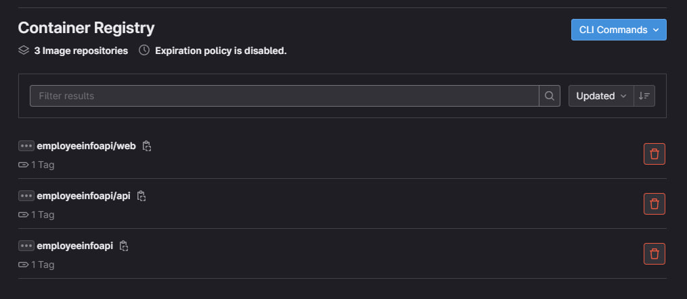
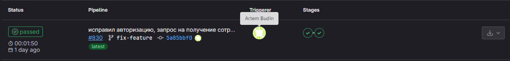
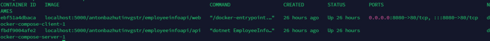

## Реализация архитектуры на основе сервисов (микросервисной архитектуры)

### Предварительные работы:
- Настроек Container Registry на сервере GitLab (https://docs.gitlab.com/ee/user/packages/)
 - Проброшены порты с сервера GitLab до целевего сервера, так как смог запустить Container Registry только локально на сервере GitLab.

### Упаковка контейнеров:

Написаны докер-файлы для UI интерфейса и backend сервиса:

Backend:

    FROM mcr.microsoft.com/dotnet/aspnet:6.0 AS base
    WORKDIR /app
    EXPOSE 4000

    FROM mcr.microsoft.com/dotnet/sdk:6.0 AS build
    WORKDIR /src
    COPY ["EmployeeInfoAPI/EmployeeInfoAPI.csproj", "EmployeeInfoAPI/"]
    RUN dotnet restore "EmployeeInfoAPI/EmployeeInfoAPI.csproj"
    COPY . .
    WORKDIR "/src/EmployeeInfoAPI"
    RUN dotnet build "EmployeeInfoAPI.csproj" -c Release -o /app/build

    FROM build AS publish
    RUN dotnet publish "EmployeeInfoAPI.csproj" -c Release -o /app/publish /p:UseAppHost=false

    FROM base AS final
    WORKDIR /app
    COPY --from=publish /app/publish .
    ENTRYPOINT ["dotnet", "EmployeeInfoAPI.dll"]

Frontend:

    FROM node:21.6 AS build

    WORKDIR /app

    COPY package.json package-lock.json ./

    RUN npm install

    COPY . .

    RUN npm run build

    FROM nginx:alpine

    COPY --from=build /app/build /usr/share/nginx/html

    #COPY nginx/nginx.conf /etc/nginx/nginx.conf

    EXPOSE 80

    CMD ["nginx", "-g", "daemon off;"]

Для UI использовать сервис nginx для возможности дальнейшего проксирования запросов к сервисам.

### CI/CD

.gitlab-ci.yml:

    variables:
    TARGET_SERVER: adisadmin@192.168.1.56
    stages:
    - build
    - deploy

    before_script:
    - ssh-keyscan 192.168.1.56 >> ~/.ssh/known_hosts
    - chmod 644 ~/.ssh/known_hosts

    build:
    stage: build
    image: docker:latest
    services:
        - docker:dind
    script:
        - docker login -u $CI_REGISTRY_USER -p $CI_REGISTRY_PASSWORD localhost:5000
        - docker build -t localhost:5000/antonbazhutinvgstr/employeeinfoapi/api .
        - docker push localhost:5000/antonbazhutinvgstr/employeeinfoapi/api
        - cd ./employee-info
        - docker build -t localhost:5000/antonbazhutinvgstr/employeeinfoapi/web .
        - docker push localhost:5000/antonbazhutinvgstr/employeeinfoapi/web

    deploy:
    stage: deploy
    services:
        - docker:dind
    script:
        - ssh $TARGET_SERVER "docker login -u $CI_REGISTRY_USER -p $CI_REGISTRY_PASSWORD localhost:5000"
        - ssh $TARGET_SERVER "cd /server/FRMR/docker-compose/ && ls && docker-compose pull && docker-compose up -d --force-recreate"

- Перед запускам jobs устанавливается ssh соединение между сервером GitLab и целевым сервером. 
- На стадии `build` происходит авторизация пользователя в сервисе Container Registry, сборка образов и отправка их в локальный репозиторий образов.
- На стадии `deploy` происходит авторизация пользователя в сервисе Container Registry, далее переход в папку в файлом docker-compose, на целевом сервере подтягиваю и запускаются указанные образы в docker-compose файле.

docker-compose.yml:

version: "3"

    services:

    server:
        image: localhost:5000/antonbazhutinvgstr/employeeinfoapi/api
        network_mode: "host"
        environment:
        - "CONNECTION_STRING=mongodb://127.0.0.1:27017"

    client:
        image: localhost:5000/antonbazhutinvgstr/employeeinfoapi/web
        ports:
        - 8080:80
        depends_on:
        - server

В результате работы pipeline можно увидеть контейнеры в репозитории

